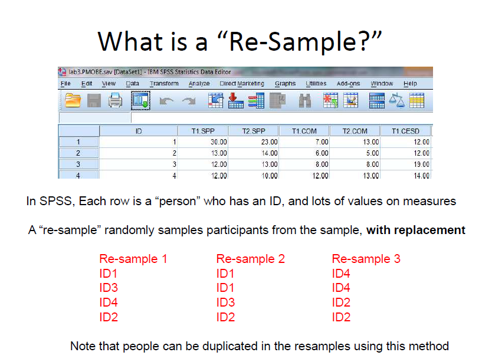
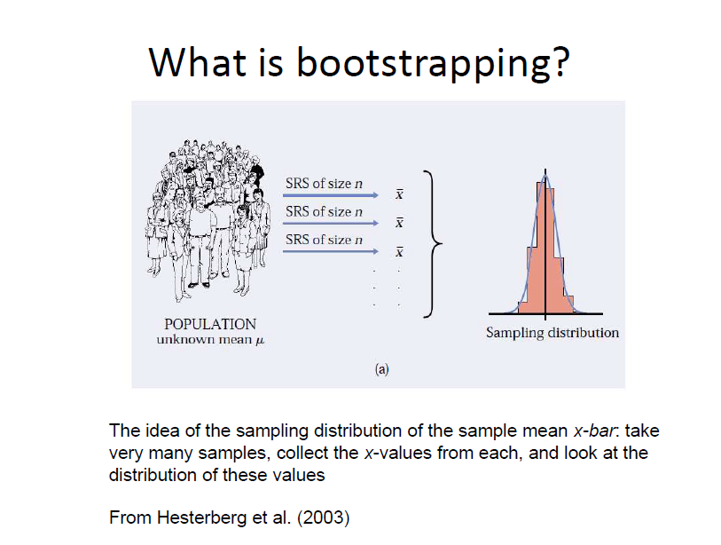
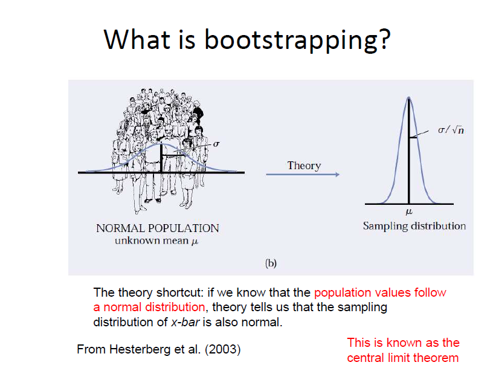
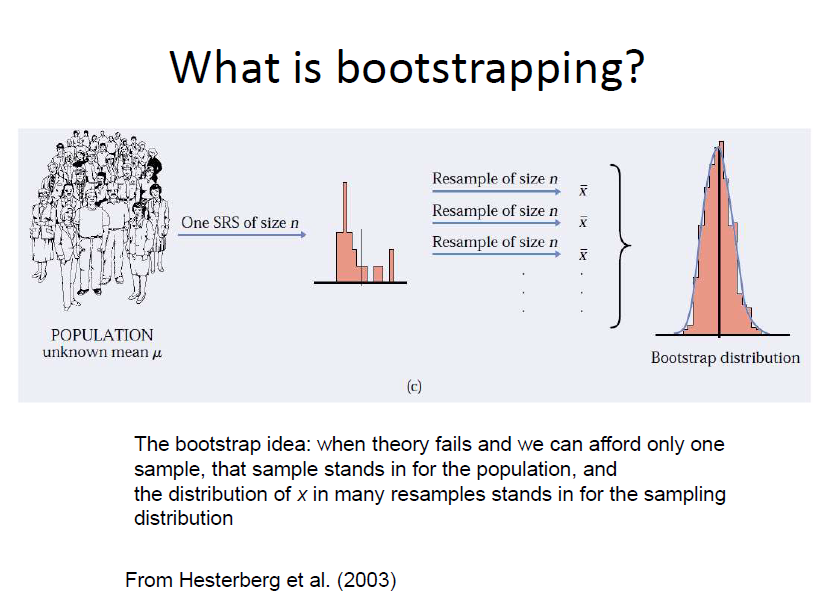

- Let's see what is _re-sample_
  
- Now let's check the idea behind _sampling distribution_
  
- Briefly the theory of _sampling distribution_
  
- Finally, here comes the idea of _bootstrapping_
  

**Slide Credit:** https://www.slideshare.net/smackinnon/introduction-to-mediation

Here's another nice discussion on boottsrapping https://www.iwh.on.ca/what-researchers-mean-by/bootstrapping
