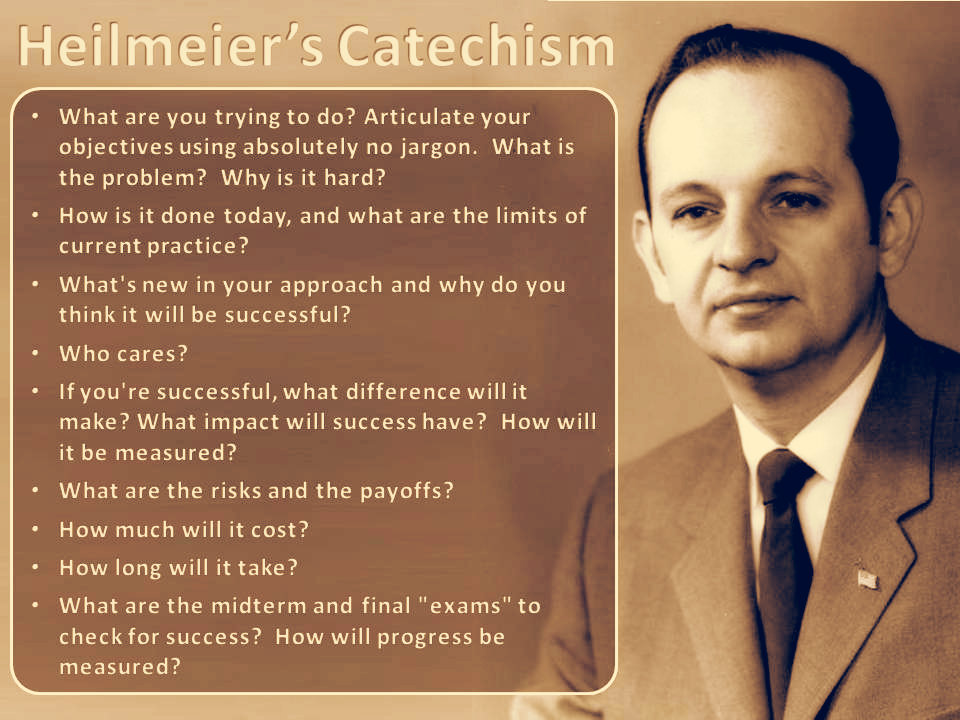

To read more:
- [The Heilmeier Catechism](https://www.darpa.mil/work-with-us/heilmeier-catechism)
- [Image credit](https://www.ifm.eng.cam.ac.uk/research/grant-writers-handbook/drafting-the-proposal/)
